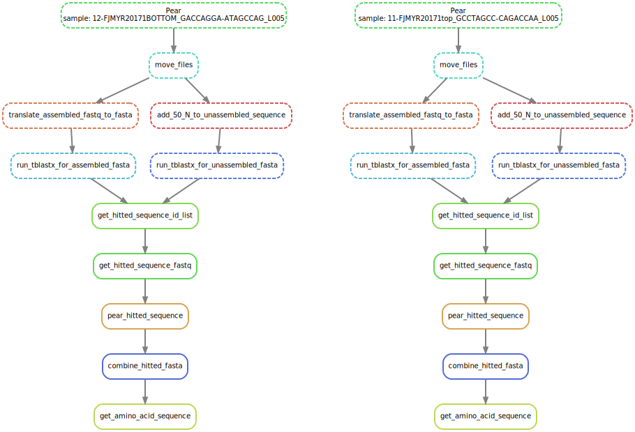

# Metagenomic-project
Songjun's master degree project about functional metagenomic 

## Description
This project is a workflow to process the raw metagenomic dataset for two annotation servers: MG-RAST and GhostKOALA, and integrate the final abundance number into KEGG pathwy.

The workflow include two steps:

First part is a snakemake pipeline, which translate raw fastq files into filtered fasta files and faa files that are ready for annotation servers.

Example: 


Second part is a python script and a R shiny app, which generates annotated results from GhostKOALA in KEGG website and visualizes them in kegg pathway by using the shiny app based on pathview package.

A metadata file is also necessary for the python script. It is used for grouping results from annotation server. A exapmle file is attached in metadata.txt.

usage: 

```
./group.py metadata.txt output.csv
```


### Dependencies
Required software and version:
* Python/3.7.3, R/4.0.1, snakemake/5.26.1, Fastqc/0.11.8, Mulitqc/1.8, PEAR/0.9.1, seqtk/1.0, BLAST/2.5.0+, SPAdes/3.9.1, bwa/0.7.17


